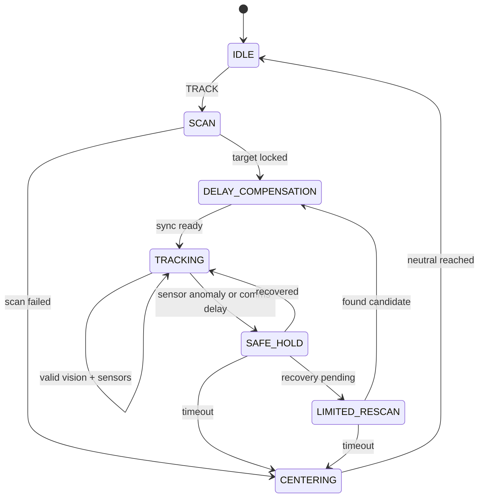

# Architecture

## Runtime Split

The project follows the plan from the design PDF:

1. Web command layer
   - Streamlit creates only validated command packets.
   - Commands are restricted to `TRACK`, `STOP`, `CENTER`, and `REDETECT`.
   - Hardware control never runs inside the Streamlit rerun loop.

2. Edge layer on Raspberry Pi 4
   - Captures frames into a timestamped ring buffer.
   - Receives vision results from the RTX server.
   - Validates results with ToF and ultrasonic distance samples.
   - Runs the state machine and PD servo controller.
   - Emits status packets for the web screen.
   - Performs active scan, K-frame initial lock, safe-hold, limited rescan, and center return.
   - Ignores replayed command ids and stale inference packets before they can reach servo control.

3. Server layer on RTX laptop
   - Performs initial open-vocabulary target selection with local WeDetect-Ref.
   - Hands the selected box to YOLO26 + BoT-SORT or ByteTrack.
   - Sends timestamped `TrackingResult` packets back to the edge device.
   - If YOLO loses the locked target for `server.yolo_lost_frames` consecutive frames,
     the server clears the YOLO lock and runs WeDetect again on the current frame.
   - If YOLO returns a high-confidence but structurally suspicious candidate, the
     server treats it separately from a missing target and does not pass that bbox
     to servo control.

The RTX process binds `zmq.frame_bind_endpoint` and `zmq.result_bind_endpoint`.
The Raspberry Pi connects to `zmq.frame_connect_endpoint` and
`zmq.result_connect_endpoint`, so the two roles can run on different hosts.

## State Flow



## Packet Contracts

Web command:

```json
{
  "packet": "web_command",
  "cmd_id": "track-1683528401000",
  "cmd_type": "TRACK",
  "query": "red cup",
  "scan_range_deg": 45,
  "max_speed_deg_s": 20,
  "ts": 1683528401000300
}
```

Status response:

```json
{
  "packet": "status_ack",
  "cmd_id": "track-1683528401000",
  "ack": true,
  "system_state": "TRACKING",
  "pan_deg": -12.4,
  "tilt_deg": 3.1,
  "rtt_ms": 95,
  "confidence": 0.86
}
```

## Control Loop

The control loop converts image-space target error into servo commands:

1. Detection center `(x, y)` is converted to yaw/pitch error using the camera FOV.
2. A per-axis PD controller produces target angular velocity.
3. Small errors inside `deadband_deg` are ignored to avoid jitter.
4. `max_speed_deg_s` clamps target velocity.
5. `max_accel_deg_s2` limits velocity changes for soft motion and safe-hold.
6. Integrated target angle is clamped to software axis limits.
7. Target angle is mapped to 50 Hz servo PWM pulse width.

## Safe Hold

`SAFE_HOLD` is a powered soft-stop, not a full shutdown. New vision coordinates are not used as control input. The controller sets target angular velocity to zero and lets the acceleration limiter bring the mount to a stable stop. Sensor sampling and redetection may continue so the system can recover when the same target is confirmed again.
Redetection requests are carried on the next ZMQ frame header so the server can reset the WeDetect/YOLO lock before returning a new candidate.

YOLO target loss is treated as a first-class recovery path. While the server has a
WeDetect lock, normal frames are processed by YOLO + tracker. If YOLO returns no
candidate, the server emits an empty `TrackingResult`; the edge validator counts
that as a missing vision result and can enter `SAFE_HOLD` after the configured
consecutive-frame threshold. After the server-side lost-frame threshold is reached,
the RTX process reruns local WeDetect on the latest frame. A successful candidate
becomes the new YOLO lock; an unsuccessful redetection remains an empty result so
the edge side keeps soft-stopping, limited rescanning, or returning to center.

## YOLO Candidate Guard

The server separates three YOLO failure modes:

1. Missing target: YOLO returns no bbox. The server counts this with
   `yolo_lost_frames`, emits an empty result while waiting, and then asks local
   WeDetect to redetect the target.
2. Similar-object switch: YOLO returns a bbox, often with high confidence, but
   its center jumps too far from the WeDetect-locked target or its tracker id
   changes without enough IoU overlap. A short tracker id change is still accepted
   when the bbox stays spatially stable in center and area. Otherwise, the server counts this with
   `yolo_suspect_frames` and never sends that suspicious bbox to the edge servo
   controller.
3. Large-background absorption: YOLO returns a high-confidence bbox that has
   expanded onto a background object or a larger overlapping object. The server
   rejects it when the bbox area grows too much, occupies too much of the frame,
   or changes aspect ratio too sharply.

High confidence is not sufficient to accept a candidate. Confidence only clears
the model-score threshold; the candidate must still pass geometric continuity
checks against the previous WeDetect/YOLO lock. If every YOLO candidate is
rejected, the server emits an empty result until the suspect-frame threshold asks
WeDetect to re-evaluate the current frame.

The edge runtime repeats the large-bbox continuity check during `SAFE_HOLD`
recovery. This prevents a stale tracker id from recovering the system into
`TRACKING` when the bbox has actually grown onto a larger object.

## Hugging Face WeDetect-Ref Contract

Production mode uses WeDetect-Ref locally. The RTX server downloads WeDetect-Ref
and the WeDetect-Uni proposal checkpoint from Hugging Face Hub unless explicit
local paths are provided:

```toml
[server]
wedetect_ref_repo_id = "fushh7/WeDetect-Ref-2B"
wedetect_uni_repo_id = "fushh7/WeDetect"
wedetect_uni_filename = "wedetect_base_uni.pth"
wedetect_cache_dir = ""
wedetect_ref_model_dir = ""
wedetect_uni_checkpoint = ""
wedetect_ref_module = "my_wedetect_ref_runtime:detect"
wedetect_ref_script = ""
wedetect_device = "cuda:0"
yolo_lost_frames = 12
yolo_suspect_frames = 2
yolo_max_center_jump_px = 120.0
yolo_max_area_growth_ratio = 4.0
yolo_max_frame_area_ratio = 0.35
yolo_max_aspect_ratio_change = 3.0
yolo_min_iou_on_id_change = 0.10
```

The module callable receives `frame_bytes`, `query`, `ts_req`,
`wedetect_ref_model_dir`, `wedetect_uni_checkpoint`, and `device`. It may return a
`TrackingResult` or a dict with `bbox`, `confidence`, `track_id`, and optional
timestamp fields. If the team keeps WeDetect-Ref as a separate script, set
`wedetect_ref_script`; the runtime writes the frame to a temporary image file and
passes the official-style `--wedetect_ref_checkpoint`, `--wedetect_uni_checkpoint`,
`--image`, and `--query` arguments.

## Runtime Commands

Run the RTX-side vision process:

```bash
iot-server --config config/settings.toml --serve --production
```

Run the Raspberry Pi edge process:

```bash
iot-edge --config config/settings.toml --run
```

Run it with real PCA9685 and distance sensors:

```bash
iot-edge --config config/settings.toml --run --hardware-servo --hardware-sensors
```

Run the web command surface:

```bash
streamlit run src/iot_servo_tracker/web/app.py
```
