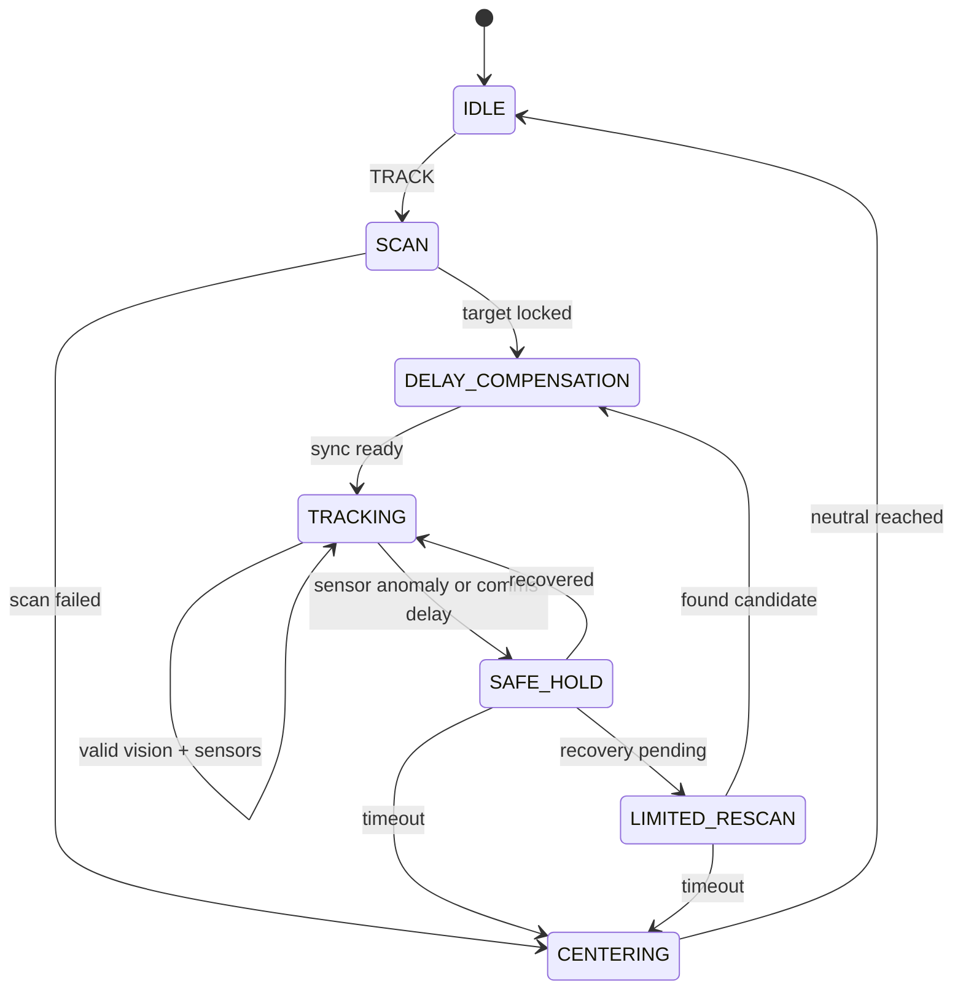

# Architecture

## Runtime Split

The project follows the plan from the design PDF:

1. Web command layer
   - Streamlit creates only validated command packets.
   - Commands are restricted to `TRACK`, `STOP`, `CENTER`, and `REDETECT`.
   - Hardware control never runs inside the Streamlit rerun loop.

2. Edge layer on Raspberry Pi 4
   - Captures frames into a timestamped ring buffer.
   - Receives vision results from the RTX server.
   - Validates results with ToF and ultrasonic distance samples.
   - Runs the state machine and PD servo controller.
   - Emits status packets for the web screen.
   - Performs active scan, K-frame initial lock, safe-hold, limited rescan, and center return.
   - Ignores replayed command ids and stale inference packets before they can reach servo control.

3. Server layer on RTX laptop
   - Performs initial open-vocabulary target selection with WeDetect.
   - Hands the selected box to YOLO26 + BoT-SORT or ByteTrack.
   - Sends timestamped `TrackingResult` packets back to the edge device.

The RTX process binds `zmq.frame_bind_endpoint` and `zmq.result_bind_endpoint`.
The Raspberry Pi connects to `zmq.frame_connect_endpoint` and
`zmq.result_connect_endpoint`, so the two roles can run on different hosts.

## State Flow



## Packet Contracts

Web command:

```json
{
  "packet": "web_command",
  "cmd_id": "track-1683528401000",
  "cmd_type": "TRACK",
  "query": "red cup",
  "scan_range_deg": 45,
  "max_speed_deg_s": 20,
  "ts": 1683528401000300
}
```

Status response:

```json
{
  "packet": "status_ack",
  "cmd_id": "track-1683528401000",
  "ack": true,
  "system_state": "TRACKING",
  "pan_deg": -12.4,
  "tilt_deg": 3.1,
  "rtt_ms": 95,
  "confidence": 0.86
}
```

## Control Loop

The control loop converts image-space target error into servo commands:

1. Detection center `(x, y)` is converted to yaw/pitch error using the camera FOV.
2. A per-axis PD controller produces target angular velocity.
3. Small errors inside `deadband_deg` are ignored to avoid jitter.
4. `max_speed_deg_s` clamps target velocity.
5. `max_accel_deg_s2` limits velocity changes for soft motion and safe-hold.
6. Integrated target angle is clamped to software axis limits.
7. Target angle is mapped to 50 Hz servo PWM pulse width.

## Safe Hold

`SAFE_HOLD` is a powered soft-stop, not a full shutdown. New vision coordinates are not used as control input. The controller sets target angular velocity to zero and lets the acceleration limiter bring the mount to a stable stop. Sensor sampling and redetection may continue so the system can recover when the same target is confirmed again.
Redetection requests are carried on the next ZMQ frame header so the server can reset the WeDetect/YOLO lock before returning a new candidate.

## Runtime Commands

Run the RTX-side vision process:

```bash
iot-server --config config/settings.toml --serve --production
```

Run the Raspberry Pi edge process:

```bash
iot-edge --config config/settings.toml --run
```

Run it with real PCA9685 and distance sensors:

```bash
iot-edge --config config/settings.toml --run --hardware-servo --hardware-sensors
```

Run the web command surface:

```bash
streamlit run src/iot_servo_tracker/web/app.py
```
